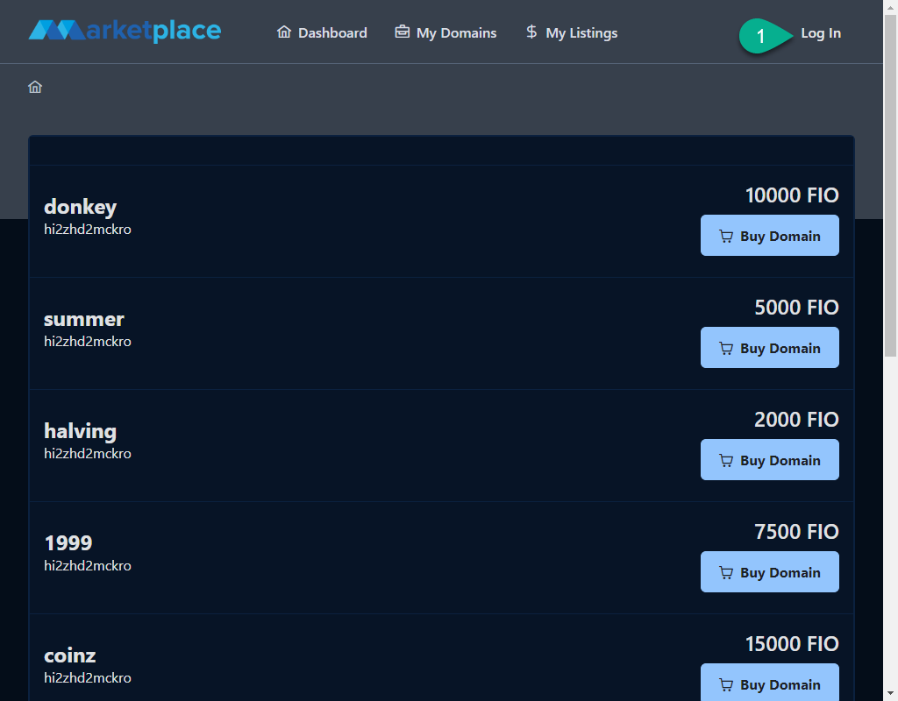
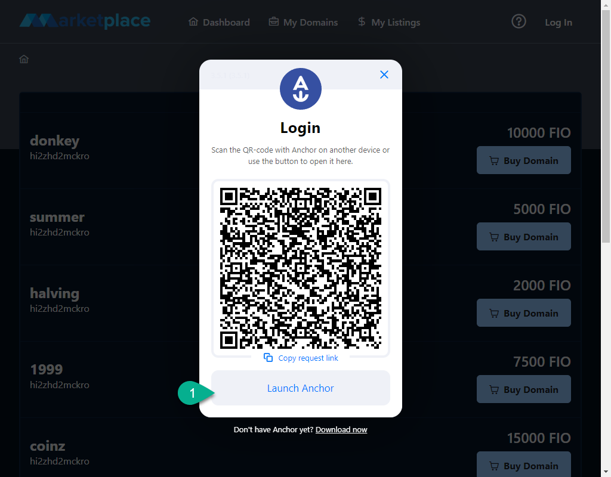
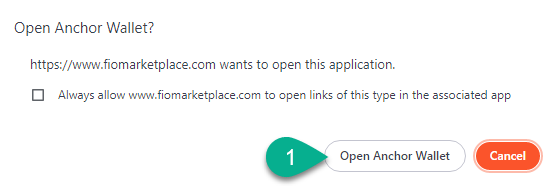
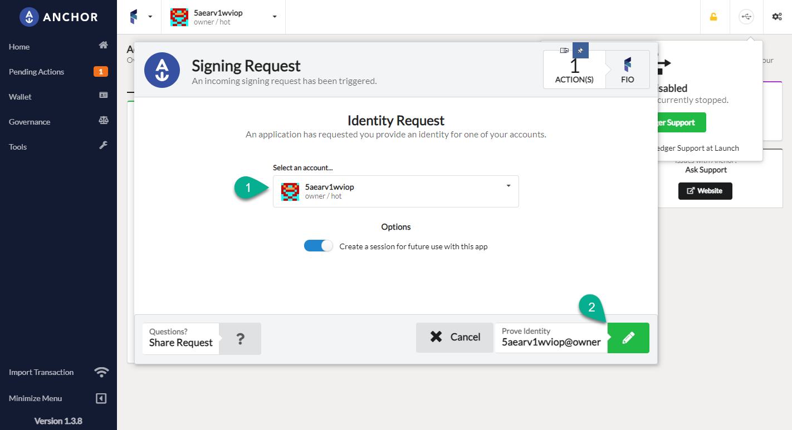
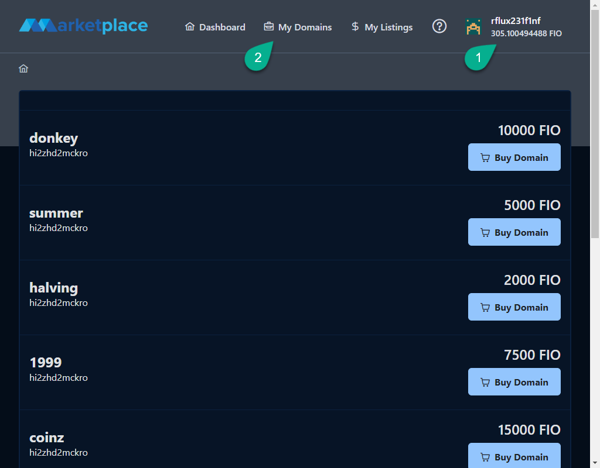
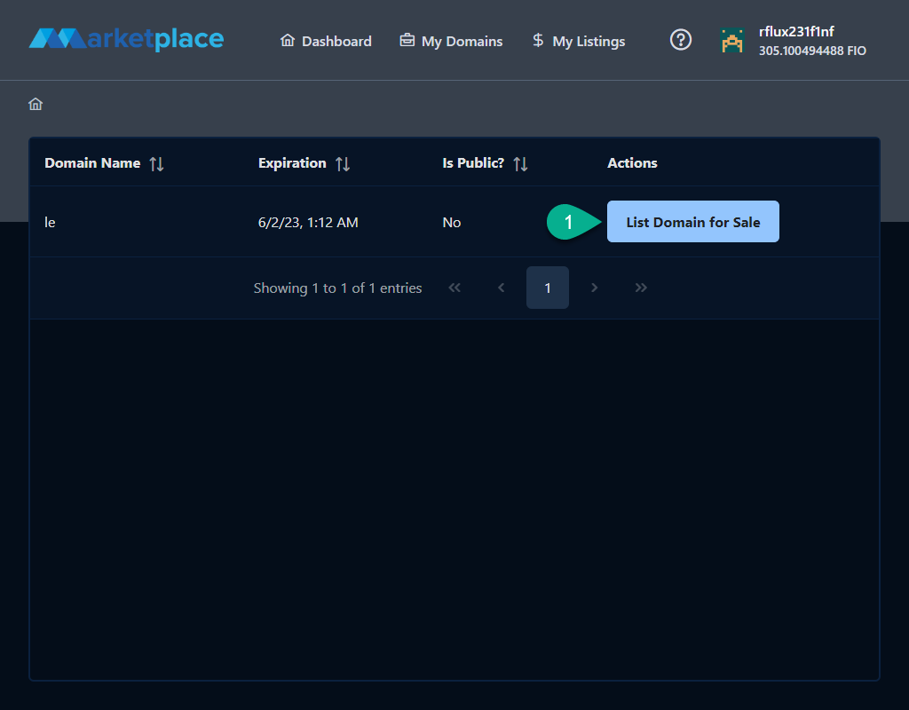
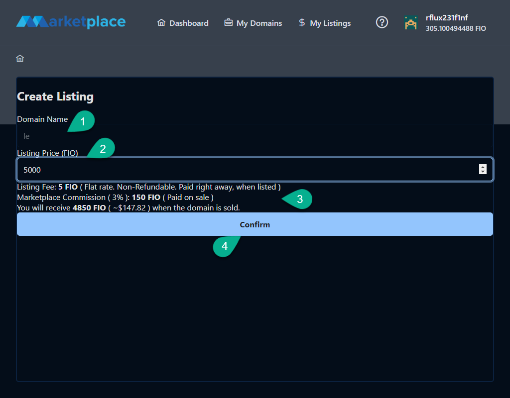
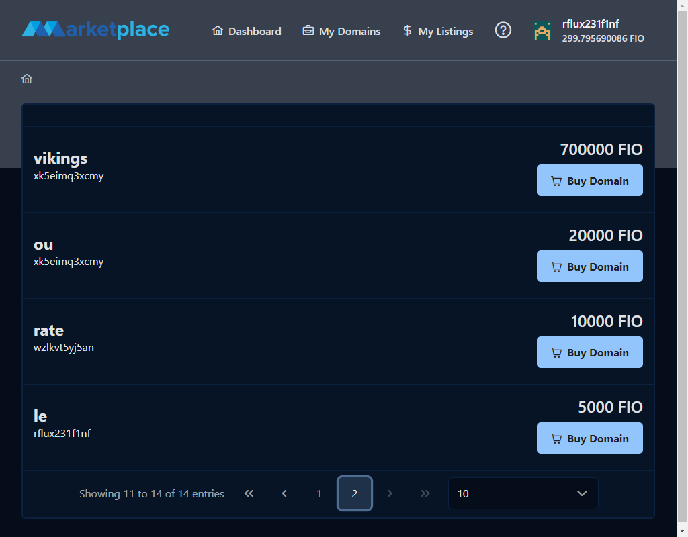
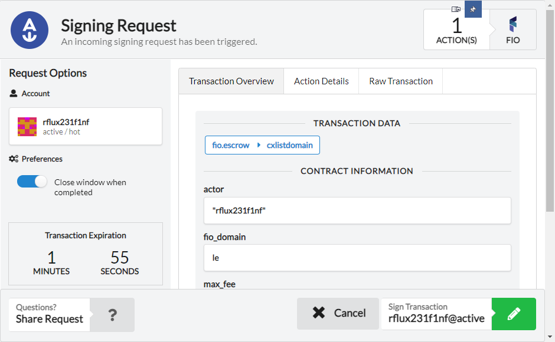

# FIO Marketplace Guide

This guide assumes you already have Anchor Wallet set up with a FIO account and your domains are on that account. For instructions on how to import keys from Edge Wallet to Anchor Wallet see this guide (Link to be added).

## Login 

Click the login button in the top right corner of the page

A modal will pop up to launch Anchor Wallet. Click `Launch Anchor`

Another popup window might open that asks permission to open anchor wallet. CLick `Open Anchor Wallet`

Select your account and click on the bottom right button. It might be a blue button with a lock icon or a green button with a pencil. 

If it's a blue button with a lock icon it will prompt you for a password. Enter your wallet password to unlock the wallet.

## List A Domain

Verify you're logged in by making sure your account name and FIO balance appear in the top right corner. Then click on `My Domains`

Find the domain you would like to list for sale and click `List Domain for Sale`

1. Verify the domain name you want to sell
2. Enter the list price in FIO. 
3. Review the fees. 
   - There is a flat listing fee that is collected immediately on listing and is non-refundable.
   - There is a 3% commission fee and it is calculated how much that will be in FIO based on the listing price. In this case 150 FIO out of the 5000 FIO listing price.
   - The last thing is the amount of FIO you will receive and the approximate value based on the current FIO price. In this case 4850 FIO.
4. Click `Confirm`

Anchor wallet will pop up with a __Signing Request__. Here you can verify the information. 
- The `actor` is your account name
- The `fio_domain` is the domain you are listing
- The `sale_price` is the price you are listing the domain for, and the denomination is SUFs (**S**mallest **U**nit of **F**IO) this is the value you put in multiplied by 1 billion. In this case 5,000,000,000,000 SUFs. (added commas for clarity).
- The `max_fee` is the maximum amount of FIO you are willing to pay for the transaction also listed in SUFs.

Click the green button with a pencil to sign the transactions.

A newly listed domain will show up at the end by default. Clicking the 2nd page of domains will show the domain listed

## Cancel a Listing

Click `My Listings` to view the active listings on the marketplace.

You will see a list of domains currently for sale. 

Click the `Cancel Listing` button. 

You will get a signing request for this transaction. 

Click the green button with a pencil to sign the transaction.

Once signed your domain will show up under `My Domains` again.
